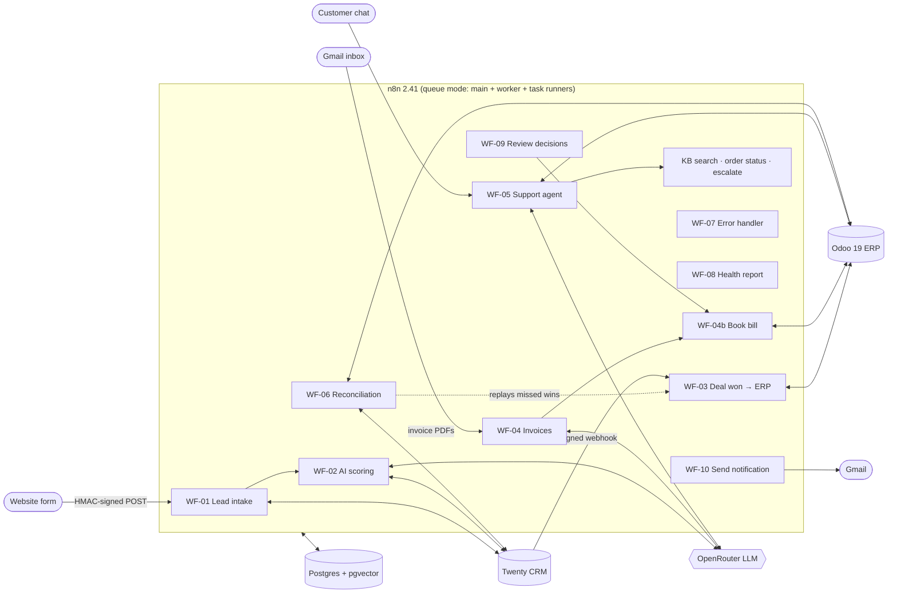

# Order-to-Cash Automation for a B2B Wholesaler (n8n)

**Muster GmbH** (fictional) is a Hamburg wholesaler for hotels, restaurants and canteens. Its team
copies data by hand between the website, the CRM, the ERP and email. This project automates that
process end to end with **n8n**: from the first website enquiry to the confirmed sales order,
supplier invoices, customer support and a nightly consistency check.

Everything runs locally with one `docker compose up`. There are no backend services: all logic is
in 16 n8n workflows, and custom logic lives in small, single-purpose Code nodes.

| | What happens automatically |
|---|---|
| **Leads** | Signed website form → validated, deduplicated, stored → company, person, opportunity and note in **Twenty CRM** → **AI lead score** (0–100 with reason) → hot leads emailed to sales |
| **Won deals** | Opportunity dragged to *Customer* in Twenty → customer found or created in **Odoo** → **sales order created and confirmed** → order number written back to the CRM |
| **Supplier invoices** | PDF by email or upload → **vision LLM** extracts the data → numbers re-checked (line math, VAT, totals, duplicates) → **vendor bill posted in Odoo** with the PDF, or sent to **human review** |
| **Support** | Public chat (German/English) → AI agent answers from the **knowledge base (pgvector)**, looks up **order status in Odoo** (order number + email), and **escalates** to a person with a ticket |
| **Operations** | Nightly **CRM ↔ ERP reconciliation** (auto-fixes safe drift, replays missed events) · central **error handler** · **daily health report** · **approve/reject links** in review emails |

## Architecture



Details per workflow are in [docs/ARCHITECTURE.md](docs/ARCHITECTURE.md).

**Engineering highlights**
- **Security:** both inbound webhooks are HMAC-signed with a 5-minute replay window, verified over the
  raw bytes in constant time. Credentials are restricted to their Docker hostnames. Code runs in a
  sandboxed task-runner container. Email approval links are single-use, only their hash is stored,
  and they need a POST, so link scanners can't click them.
- **Never trust the AI:** strict JSON schemas, server-side validation of every number, a confidence
  threshold, a rule-based fallback, and the data passed to the model is treated as untrusted
  (prompt-injection tested).
- **Idempotent by design:** dedupe keys, `sync_map`, SHA-256 per file, and atomic claims. Retries
  and replays never create duplicates.
- **Observable:** every workflow logs to `event_log`, every failure reaches `workflow_errors`
  plus an email, and a daily traffic-light report covers the rest.

## Quick start

```bash
./scripts/generate-env.sh          # .env with random secrets; then set ALERT_EMAIL_TO
docker compose up -d               # n8n, worker, runners, Postgres, Redis, Odoo, Twenty
```

Then create the five credentials, import the workflows and run the two setup workflows, as described
in [docs/SETUP.md](docs/SETUP.md) (about 20 minutes, mostly Google OAuth). Test everything with:

```bash
./scripts/send-test-lead.sh test-payloads/lead-de-valid.json
./scripts/upload-document.sh sample-documents/*.pdf
```

**Stack:** n8n 2.41.4 · Postgres 17 + pgvector · Redis 8 · Odoo 19 Community · Twenty CRM 2.43 ·
OpenRouter (gpt-4.1-mini, text-embedding-3-small) · Gmail

## Demo script (≈ 4 minutes)

| Time | Show | Say |
|---|---|---|
| 0:00 | This README, the diagram | "A wholesaler retypes every lead, order and invoice. I automated the whole order-to-cash path in n8n." |
| 0:20 | Terminal: `send-test-lead.sh lead-de-valid.json` → `202` | "The website posts a signed lead. Wrong signature: 401. Invalid data: 422." |
| 0:40 | Twenty → *Opportunities*: new card with **Lead Score 85** and reason; inbox: *Hot lead* mail | "The lead is deduplicated, created in the CRM and scored by an LLM with a strict schema. A fallback keeps it working when the AI is down." |
| 1:20 | Drag the card to **Customer** → Odoo *Sales*: confirmed order; card shows **ERP Order Ref** | "A signed webhook from the CRM creates customer and order in Odoo. It's idempotent: dragging it twice doesn't create two orders." |
| 2:00 | `upload-document.sh sample-documents/*.pdf` → Odoo *Bills* + review mail | "Invoices are read by a vision model, but every number is re-checked. The clean ones are posted with the PDF attached. The wrong total, the blurry scan and the duplicate go to a person." |
| 2:50 | Click **Approve** in the review mail → confirmation page → draft bill | "Approval links are single-use and need a confirmation click, so email scanners can't trigger them." |
| 3:10 | Chat: *"Wie hoch ist der Mindestbestellwert?"*, then *"Status of order S00002?"* + email | "The support agent answers in German or English from the knowledge base, and only shows order data when number and email match." |
| 3:40 | n8n: WF-06 execution, report mail; `workflow_errors` | "Every night the CRM and ERP are compared. Missed events are replayed, the rest is reported. Every failure lands in one error table and one mail." |

## Repository

```
docker-compose.yml   all services, pinned versions        db/            init.sql, odoo-setup.py
workflows/           16 importable n8n workflows           scripts/       env, import/export, test senders
knowledge-base/      chatbot docs (DE + EN)                sample-documents/  test invoices + generator
test-payloads/       webhook bodies                        docs/          SETUP · ARCHITECTURE · PROCESS-ANALYSIS · RUNBOOK
```

## Kurzfassung (Deutsch)

Die (fiktive) **Muster GmbH**, ein Hamburger Großhändler für Gastronomie und Hotellerie, überträgt
Leads, Aufträge und Rechnungen bisher manuell zwischen Website, CRM, ERP und E-Mail. Dieses Projekt
automatisiert den gesamten Order-to-Cash-Prozess mit **n8n**:

- **Leads** von der Website werden signiert empfangen, geprüft, dedupliziert, im CRM (**Twenty**)
  angelegt und per **KI bewertet**. Heiße Leads meldet das System per E-Mail an den Vertrieb.
- **Gewonnene Deals** erzeugen automatisch Kunde und **bestätigten Auftrag in Odoo**.
- **Eingangsrechnungen** (PDF per E-Mail) werden per KI ausgelesen, rechnerisch geprüft und als
  **Lieferantenrechnung in Odoo gebucht**. Unklare Belege gehen in eine **Freigabe-Warteschlange**
  mit Freigabe-Link.
- Ein **Support-Chatbot** beantwortet Fragen auf Deutsch und Englisch aus der Wissensdatenbank,
  zeigt den **Bestellstatus** (nur mit Bestellnummer + E-Mail) und übergibt bei Bedarf an einen Menschen.
- Ein **nächtlicher Abgleich** CRM ↔ ERP, ein **zentrales Fehler-Handling** und ein **täglicher
  Statusbericht** sorgen für einen stabilen Betrieb.

Ergebnis (Annahmen siehe [Prozessanalyse](docs/PROCESS-ANALYSIS.md)): rund **95 Stunden
Handarbeit pro Monat** weniger, Leads werden in Sekunden statt am nächsten Tag bearbeitet, und
Rechnungen werden vor der Buchung systematisch geprüft.

---
*Portfolio project. Muster GmbH and all data, invoices and documents are fictional.*
