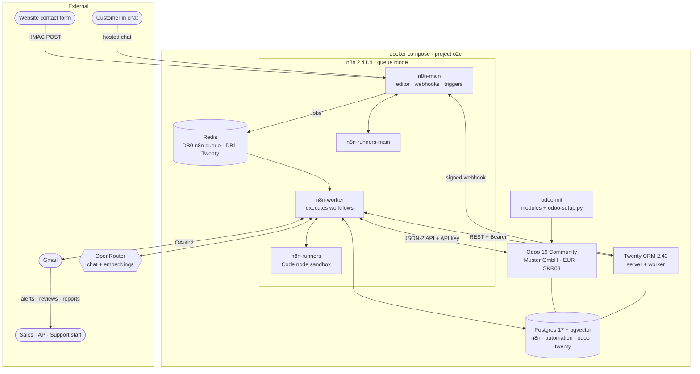
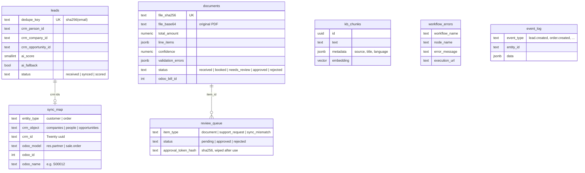
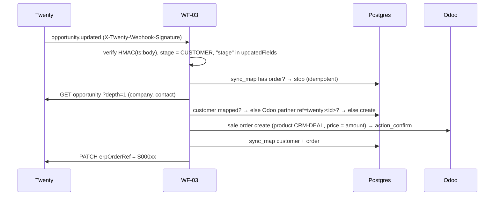
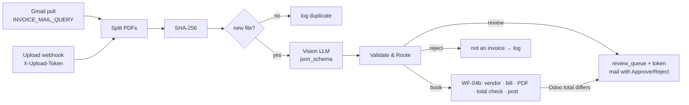
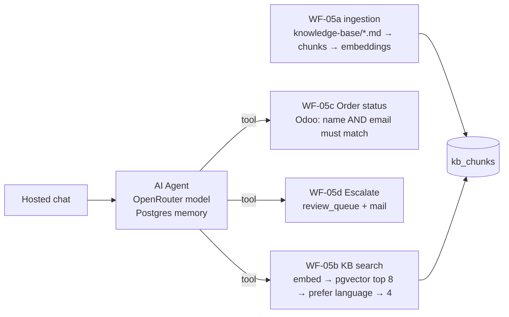

# Architecture

## 1. System overview



| Container | Role | Exposed |
|---|---|---|
| `n8n-main` | Editor, webhooks, schedules, polling triggers. Executes nothing itself (queue mode). | `:5678` |
| `n8n-worker` | Runs every execution from the Redis queue | – |
| `n8n-runners`, `n8n-runners-main` | External task runners: Code node JavaScript runs isolated from n8n and its credentials; `crypto` allowlisted | – |
| `postgres` | 4 databases with 4 roles: `n8n`, `automation` (project), `odoo`, `twenty`; pgvector extension | `127.0.0.1:5434` |
| `redis` | n8n Bull queue (DB 0), Twenty BullMQ (DB 1), `noeviction` | – |
| `odoo` / `odoo-init` | ERP; init installs modules and applies `db/odoo-setup.py` idempotently on every start | `:8069` |
| `twenty-server` / `twenty-worker` | CRM; outbound webhooks allowlisted to `n8n-main` only | `:3000` |

## 2. Data model (`automation` database)



n8n's agent memory adds `chat_histories` (session id, messages) to the same database.

## 3. Workflows

All workflows have fixed IDs (`o2cWf…`), use **WF-07** as error workflow (except WF-07 and WF-10,
on purpose, to avoid loops), retry external calls 3× with a pause, and reference credentials only
by name.

### WF-01 Lead Intake → WF-02 AI Lead Qualification

```mermaid
sequenceDiagram
    participant W as Website
    participant N as WF-01
    participant DB as Postgres
    participant T as Twenty
    participant A as WF-02
    participant L as LLM
    W->>N: POST /webhook/lead-intake (X-Muster-Signature)
    N->>N: HMAC over raw body, ±5 min window
    alt bad signature / invalid data
        N-->>W: 401 / 422 (+ event_log)
    end
    N->>DB: upsert leads ON CONFLICT dedupe_key
    N-->>W: 202 Accepted (CRM sync continues async)
    N->>T: find company (domain or name) / create
    N->>T: upsert person (by email)
    N->>T: create opportunity (once per lead) + note with message
    N->>DB: save crm ids, event_log
    N-)A: { leadId } (fire-and-forget)
    A->>L: rubric + lead as untrusted data, json_schema
    A->>A: validate; else rule-based fallback (≤ 69)
    A->>DB: ai_* columns
    A->>T: Lead Score + Reason fields
    A->>A: score ≥ 70 and not fallback → hot-lead mail (WF-10)
```

### WF-03 Deal Won → ERP (and WF-06 replay)



WF-06 sends the same signed event for won opportunities that have no order. The idempotency
check in WF-03 makes replays safe.

### WF-04 Document Processing → WF-04b Book Vendor Bill



Validation: quantity × price = line total, Σ lines = net, net + VAT = total, VAT = Σ(line × rate),
rate ∈ {0, 7, 19}, valid dates, EUR, no booked invoice with the same supplier and number,
confidence ≥ 0.85 (poor legibility caps it at 0.4, fair at 0.8).

### WF-05 Support Chatbot (+ 05a–d)



Tools are separate workflows so each can be tested and permission-checked on its own.

### WF-06 Reconciliation (nightly 02:00)

Loads `sync_map` + stuck leads, won opportunities and companies (Twenty), and mapped orders and
customers (Odoo), then compares them:

| Finding | Action |
|---|---|
| ERP Order Ref missing/wrong in Twenty | **auto-fix** (PATCH) |
| Won opportunity without order | **auto-fix**: signed replay to WF-03 |
| Amount differs, order cancelled/missing, opportunity no longer won, name differs, record deleted, lead never synced | `review_queue` (`sync_mismatch`, deduplicated by key, token refreshed) + report |

### WF-07 · WF-08 · WF-09 · WF-10

- **WF-07** Error Trigger → summary → `workflow_errors` → alert via WF-10 (*continue on fail*).
- **WF-08** 08:00 daily: one SQL query → traffic-light report (🔴 errors or stuck leads, 🟡 old or many reviews).
- **WF-09** `GET /webhook/review-decision` shows a confirmation page only; the form's `POST` claims the item
  with one atomic `UPDATE … WHERE status='pending' AND token_hash=…`, then: approve document → WF-04b
  draft bill · reject document → `rejected` · tickets and mismatches → resolved or dismissed.
- **WF-10** the only node holding the Gmail credential. Every email goes through it.

## 4. Cross-cutting decisions

| Topic | Decision | Why |
|---|---|---|
| CRM | Twenty (self-hosted) instead of HubSpot | No external account or verification; the whole demo runs offline except the LLM and Gmail. Column names are CRM-neutral (`crm_*`). |
| ERP API | Odoo 19 JSON-2 (`/json/2/<model>/<method>`) via HTTP Request + n8n's *Odoo API (API Key)* credential | XML-RPC is being phased out; JSON-2 shows plain REST/JSON integration. |
| LLM access | OpenRouter, model names in env vars | Swap models without touching workflows; one key for chat, vision and embeddings. |
| Embeddings | HTTP call to `/embeddings` + SQL on pgvector, no LangChain vector-store node | Works with the OpenRouter credential (no 6th credential) and keeps the search query visible. |
| Binary data | `N8N_DEFAULT_BINARY_DATA_MODE=database` | Filesystem mode is not supported with separate main and worker containers. |
| Code isolation | External task runners | Code nodes can't read n8n's credentials or environment. |
| Email | One sub-workflow (WF-10) | Error logging must not depend on Gmail, because n8n refuses to start a workflow with a missing credential. Switching to Outlook or Slack is a one-node change. |
| Settings | Non-secret settings + webhook secrets via `$env` | Simple for a single-owner instance. Trade-off documented in SETUP §7. |
| Idempotency | dedupe key, file hash, `sync_map`, atomic review claims | Webhooks get retried, users double-click, events get replayed. |
| Human in the loop | `review_queue` + signed single-use links (WF-09) | AI and automation stop at uncertainty; a person decides with one click. |
