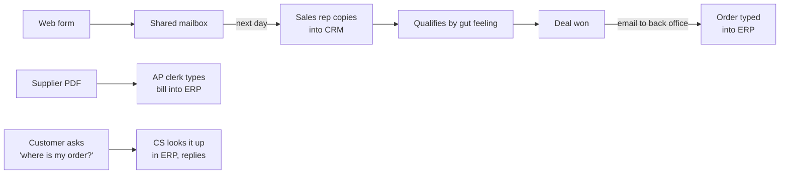
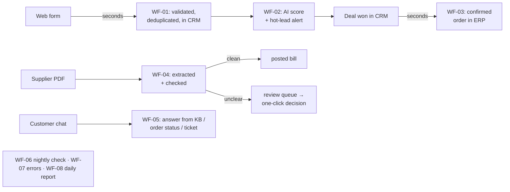

# Process analysis: Muster GmbH order-to-cash

> Muster GmbH is fictional. Volumes and times below are **assumptions** for a wholesaler of this
> size (≈ 45 employees, 4 sales reps, 2 accounts-payable clerks, 2 customer-service agents),
> chosen to be conservative. They would be replaced with measured values in a real engagement.

## 1. Starting point

| Area | Tools | Monthly volume (assumed) |
|---|---|---|
| Website enquiries | Contact form → shared mailbox | 120 leads |
| Sales pipeline | CRM, maintained by hand | 40 won deals |
| Order processing | ERP, orders typed from the CRM | 40 orders from new deals |
| Supplier invoices | PDFs by email, typed into the ERP | 350 invoices |
| Customer service | Email and phone | 450 requests |
| Management info | Excel, compiled manually | daily status |

## 2. Current process (as-is) and pain points

| # | Pain point | Effect |
|---|---|---|
| P1 | Leads sit in a mailbox until someone has time, often until the next day | Slow first response; hot leads go cold |
| P2 | Leads are copied by hand; duplicates and typos in the CRM | Unreliable pipeline, double contacts |
| P3 | No consistent qualification | Reps spend the same time on a café as on a hotel chain |
| P4 | Won deals are retyped into the ERP | 15 min per order, errors in amounts and addresses, CRM and ERP drift apart |
| P5 | Every supplier invoice typed by hand, arithmetic checked "by eye" | 6 min per invoice; wrong totals and duplicate invoices slip through |
| P6 | Repetitive support questions (delivery times, minimum order, order status) | Agents interrupted all day, slow answers outside office hours |
| P7 | No overview of errors or backlog | Problems are noticed when a customer complains |

## 3. Target process (to-be)

| Pain point | Solved by |
|---|---|
| P1, P2 | WF-01: instant processing, dedupe key on email, upsert in Twenty, the form message as a CRM note |
| P3 | WF-02: transparent AI score 0–100 with a reason in the CRM, hot leads mailed immediately |
| P4 | WF-03: won opportunity → customer and confirmed order in Odoo, order number back in the CRM; WF-06 catches drift |
| P5 | WF-04: extraction plus arithmetic, VAT and duplicate checks; only clean invoices are posted automatically, the rest goes to review |
| P6 | WF-05: 24/7 bilingual chat with knowledge base and secure order lookup; hands over to a person with a ticket |
| P7 | WF-07 error table + alert, WF-08 daily traffic-light report, `event_log` audit trail |

## 4. Time saved (estimate)

| Task | Volume / month | Before | After | Saved / month |
|---|---|---|---|---|
| Enter and qualify a lead | 120 | 12 min | 1 min (read score, act) | **22.0 h** |
| Create customer + order from a won deal | 40 | 15 min | 1 min (glance) | **9.3 h** |
| Enter a supplier invoice | 350 | 6 min | Ø 1 min (80 % auto: 0.5 min check; 20 % review: 3 min, prefilled) | **29.2 h** |
| Answer FAQ / order-status requests | 450 × 55 % = 248 | 5 min | 0 (chatbot) | **20.6 h** |
| CRM ↔ ERP consistency check | 1 | 8 h | 1 h (read report) | **7.0 h** |
| Daily status report | 21 days | 20 min | 0 | **7.0 h** |
| **Total** | | | | **≈ 95 h / month** |

95 h is about 0.6 FTE. At a loaded cost of €45/h that's **≈ €4,300 per month**.

**Running costs (estimate):** LLM usage via OpenRouter at the assumed volumes is about
120 scorings, 350 extractions and ~1,800 chat turns at gpt-4.1-mini prices, so **under €20/month**.
Hosting is a single VM (4 vCPU, 8 GB RAM) at about €30–40/month. All software is open source.

**Not counted, but often worth more:** answering a hot lead within minutes instead of the next day,
duplicate invoices not paid twice, no typos in order amounts, support available outside office hours.

## 5. KPIs to track after go-live

| KPI | Source | Target |
|---|---|---|
| Time from form submit to CRM record | `leads.created_at` vs `event_log lead.created` | < 1 min |
| Share of invoices booked without a person | `documents.status` | ≥ 75 % |
| Wrong bookings found later | AP feedback | 0 |
| Chat conversations solved without escalation | `chat.escalated` vs chat sessions | ≥ 50 % |
| Open review items older than 2 days | WF-08 | 0 |
| Workflow errors per week | `workflow_errors` | < 3, each with a known cause |

## 6. Risks and controls

| Risk | Control |
|---|---|
| AI misreads an invoice | Independent arithmetic and VAT checks, confidence threshold, Odoo total cross-check before posting, scans never auto-posted |
| AI gives a wrong answer in chat | Answers only from tool results; no prices or order data invented; escalation path |
| Prompt injection via form or chat | Untrusted text passed as data, explicit rule in prompts; tested |
| Forged webhooks | HMAC signatures + 5-minute window on both inbound webhooks |
| Personal data sent to the LLM | Only form data, invoices from a dedicated address, and chat; documented; an EU-hosted or self-hosted model is a config change (`LLM_BASE_URL`, `LLM_MODEL`) |
| Integration drift / missed events | Idempotent workflows, nightly reconciliation with replay |
| Silent failures | Central error workflow, daily report always sent |

## 7. Rollout plan (real engagement)

1. **Week 1:** workshop and measurement of the as-is times; credentials; staging copy of CRM/ERP.
2. **Week 2:** leads and won deals (WF-01–03) in shadow mode: automation runs, people still check.
3. **Week 3:** invoices (WF-04) with the threshold set to 1.0 (everything to review) for two weeks, then lowered step by step.
4. **Week 4:** chatbot on the website with a visible "talk to a person" option; KB refined from real questions.
5. **Ongoing:** WF-08 report reviewed weekly; KPIs above compared with the baseline after 3 months.
